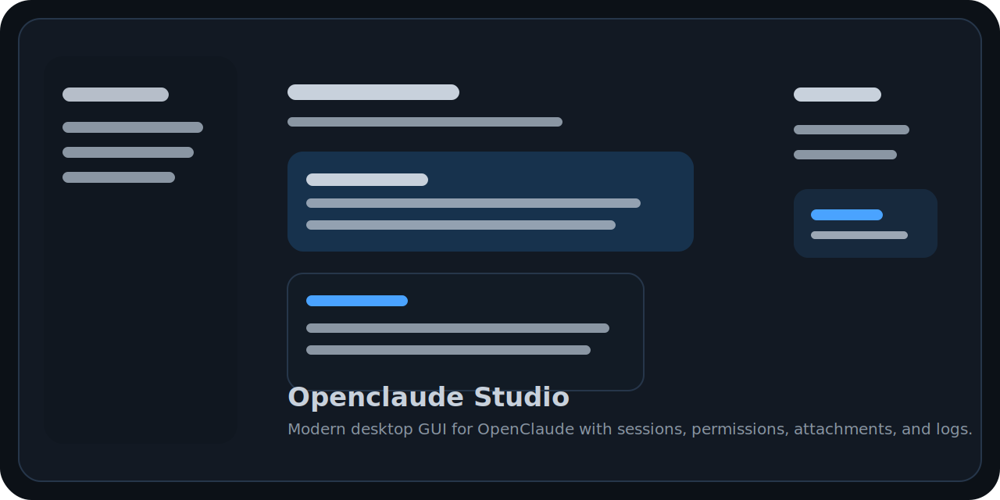

<div align="center">

# Openclaude Studio

Modern desktop GUI for OpenClaude built with Python and PyQt6.

[English](#english) | [Português do Brasil](#portugues-do-brasil)



</div>

---

## English

Openclaude Studio is a modern desktop GUI for [OpenClaude](https://github.com/Gitlawb/openclaude), built with Python and `PyQt6`.

It brings a Codex / claude.ai inspired experience to OpenClaude with a cleaner desktop workflow, persistent conversations, provider configuration, exports, Git tools, XML language files, Discord Rich Presence, and crash-safe logs.

### Features

- Modern desktop chat UI inspired by Codex and claude.ai
- OpenClaude CLI integration using `--print --verbose --output-format stream-json`
- Persistent local conversations with session resume support
- Interactive permission approvals inside the GUI
- Attachments with drag-and-drop preview
- Edit prompt, regenerate reply, continue response, duplicate chat
- Favorites, tags, stronger search, JSON import/export
- Optional Git integration with branch/status/changed files, stage, commit, pull, push, and branch creation
- XML language system with `pt_br.xml`, `en.US.xml`, and `Russian.xml`
- Optional Discord Rich Presence integration
- Full provider environment configuration
- OpenClaude print options exposed in the UI
- Runtime event timeline
- Markdown / HTML / TXT / JSON export
- Print preview and screenshot capture
- Rotating logs, crash reports, recovery snapshots, and local telemetry
- Windows build with PyInstaller and optional Inno Setup installer

### Stack

- `PyQt6`
- `qtawesome`
- `markdown-it-py`
- `Pygments`
- `pypresence`

### Installation

```bash
python -m venv .venv
.venv\Scripts\activate
pip install -r requirements.txt
```

### Run

```bash
python main.py
```

### Windows Build

To generate a test `.exe`:

```powershell
.\build_windows.ps1
```

Or manually:

```powershell
python -m unittest discover -s tests -v
pip install -r requirements.txt -r requirements-build.txt
pyinstaller --clean --noconfirm OpenclaudeStudio.spec
```

Expected output:

```text
dist/OpenclaudeStudio.exe
```

If Inno Setup 6 is installed, the project also includes:

```text
dist/installer/OpenclaudeStudio-Setup.exe
```

### OpenClaude Setup

Install OpenClaude separately:

```bash
npm install -g @gitlawb/openclaude
```

Then open the app and configure:

- executable path
- workspace directory
- model
- environment variables like `OPENAI_API_KEY`, `OPENAI_BASE_URL`, `OPENAI_MODEL`, `CLAUDE_CODE_USE_OPENAI`
- print flags such as `--include-partial-messages`, `--include-hook-events`, `--bare`

### Data Layout

The app stores project-local data in `data/`:

- `data/config.json`
- `data/conversations/*.json`
- `data/logs/app.log`
- `data/logs/crashes/*.log`
- `data/logs/telemetry.jsonl`
- `data/exports/*`
- `data/recovery/last_state.json`

### Notes

- This version focuses on the stable OpenClaude CLI headless workflow.
- The app can run without Git or Discord enabled; both integrations are optional.
- On the first run of the compiled app, make sure `openclaude` is installed globally or configure the executable path in Settings.

---

## Portugues do Brasil

Openclaude Studio é uma interface desktop moderna para o [OpenClaude](https://github.com/Gitlawb/openclaude), desenvolvida em Python com `PyQt6`.

Ele traz uma experiência inspirada no Codex e no claude.ai para o OpenClaude, com fluxo desktop mais limpo, conversas persistentes, configuração de providers, exportações, ferramentas Git, idiomas em XML, Discord Rich Presence e logs com proteção contra crash.

### Recursos

- Interface desktop moderna inspirada no Codex e claude.ai
- Integração com a CLI do OpenClaude usando `--print --verbose --output-format stream-json`
- Conversas locais persistentes com suporte a retomada de sessão
- Aprovações interativas de permissões dentro da GUI
- Anexos com preview e drag-and-drop
- Editar prompt, regenerar resposta, continuar resposta e duplicar conversa
- Favoritos, tags, busca mais forte e import/export em JSON
- Integração opcional com Git para branch, status, arquivos alterados, stage, commit, pull, push e criação de branch
- Sistema de idiomas em XML com `pt_br.xml`, `en.US.xml` e `Russian.xml`
- Integração opcional com Discord Rich Presence
- Configuração completa de providers
- Opções de print do OpenClaude expostas na interface
- Linha do tempo de eventos de execução
- Exportação em Markdown / HTML / TXT / JSON
- Preview de impressão e captura de screenshot
- Logs rotativos, relatórios de crash, recovery de rascunho e telemetria local opcional
- Build para Windows com PyInstaller e instalador opcional via Inno Setup

### Tecnologias

- `PyQt6`
- `qtawesome`
- `markdown-it-py`
- `Pygments`
- `pypresence`

### Instalação

```bash
python -m venv .venv
.venv\Scripts\activate
pip install -r requirements.txt
```

### Execução

```bash
python main.py
```

### Build no Windows

Para gerar um `.exe` de teste:

```powershell
.\build_windows.ps1
```

Ou manualmente:

```powershell
python -m unittest discover -s tests -v
pip install -r requirements.txt -r requirements-build.txt
pyinstaller --clean --noconfirm OpenclaudeStudio.spec
```

Saída esperada:

```text
dist/OpenclaudeStudio.exe
```

Se o Inno Setup 6 estiver instalado, o projeto também pode gerar:

```text
dist/installer/OpenclaudeStudio-Setup.exe
```

### Configuração do OpenClaude

Instale o OpenClaude separadamente:

```bash
npm install -g @gitlawb/openclaude
```

Depois abra o app e configure:

- caminho do executável
- diretório de trabalho
- modelo
- variáveis de ambiente como `OPENAI_API_KEY`, `OPENAI_BASE_URL`, `OPENAI_MODEL`, `CLAUDE_CODE_USE_OPENAI`
- flags de print como `--include-partial-messages`, `--include-hook-events`, `--bare`

### Estrutura de Dados

O app salva dados locais do projeto em `data/`:

- `data/config.json`
- `data/conversations/*.json`
- `data/logs/app.log`
- `data/logs/crashes/*.log`
- `data/logs/telemetry.jsonl`
- `data/exports/*`
- `data/recovery/last_state.json`

### Observações

- Esta versão foca no fluxo headless estável da CLI do OpenClaude.
- O app pode funcionar sem Git e sem Discord ativos; ambas as integrações são opcionais.
- Na primeira execução da versão compilada, garanta que o `openclaude` esteja instalado globalmente ou configure o caminho do executável nas Settings.
